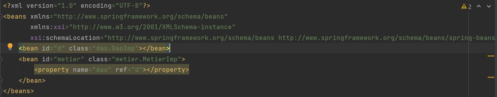
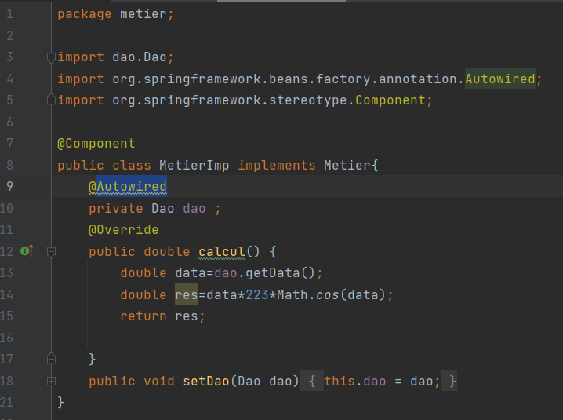

#Inversion de contrôle et Injection des dépendances 
first our project structure is a dao package and a metier package plus presentation package
this activity consist of practicing dependency injection as follows 
1. By static instantiation
2. By dynamic instantiation
3. Using the Spring Framework

   - XML version

   - Annotation version
   
##Project Structure
our project structured as follows


###dao Package

####Dao Interface


####DaoImp Class


###metier Package

####Metier Interface


####MetierImp Class


###1. By static instantiation
in this Version we used static instantiation which consist of creating all needed objects
inside one Class mainly our main Class then start injecting dependencies manly
using setters or constructor (here we used setters only)


###2. By dynamic instantiation

in this Version we used dynamic instantiation which consist of creating a config file
that holds names of all needed Classes then we start by reading those names line
by line and creat instances using the forNmae method from Class object
then after geting the Class we use newInstance() method to create an instance 
from that Class

#####Config File


#####main Class 


for injection, we used getMethod() from our instance of the Class, so we can get our
methode which is a setter method that we will use to inject the dependency needed
to our object.

```java
Method meth=cmetier.getMethod("setDao",Dao.class);
        meth.invoke(metier,dao);
```

### 3. Using the Spring Framework
for using Spring Framework we had to use a Maven Project so we can rely on Maven 
to download all the libraries (dependencies) we need
the dependencies we used are 

- spring-core
- spring-context
- spring-beans


####3.1 XML version
for this version we had to use an XML config File which will hold all our beans
each class get declared as a bean 
for classes that depends on other classes we use either property injection or 
constructor injection,
- property syntax :


```XML
 <property name="dao" ref="d"></property>
```

- constructor syntax :

```XML
 <constructor-arg index="0" ref="d"/>
```




firstly we had to create an object of ApplicationContext that we will use to
get our beans
and to that object we needed to construct it from ClassPathXmlApplicationContext
which we gave our XML config, we ended up with an object that from it we can call 
the getBean method to create our objects


####3.2 Annotation version
for this version we had to annotation which is a good practise delivered by Spring Framework
to use this version we had to modify the previous packages.
so we can put the annotation @Component above each class declaration
and where ever we have a declaration of an object that needs injection
we had to use the annotation @Autowired




and for our presentation Class
firstly we had to create an object of ApplicationContext that we will use to
get our beans
and to that object this time we needed to construct it from AnnotationConfigApplicationContext
which we gave our base packages
which well analyse all our project and in a spring container will 
create and inject the needed objects


