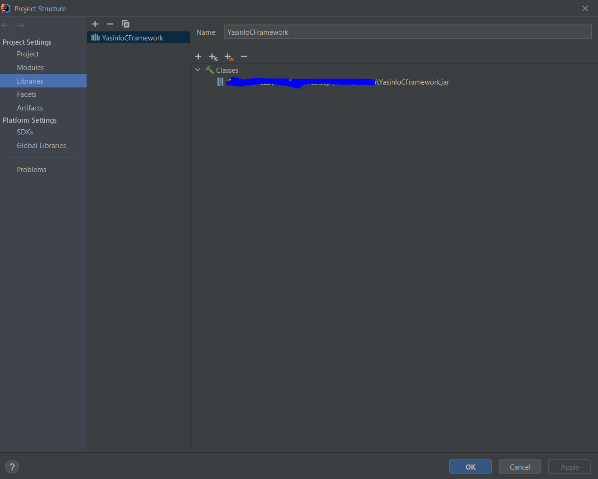
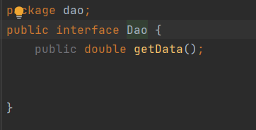
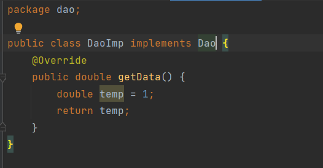
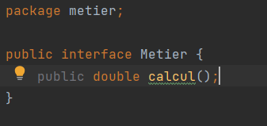
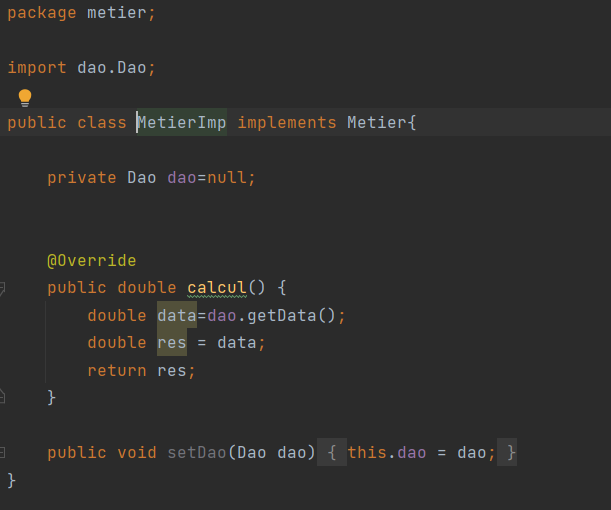
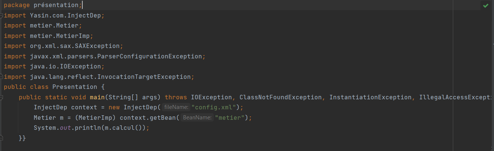
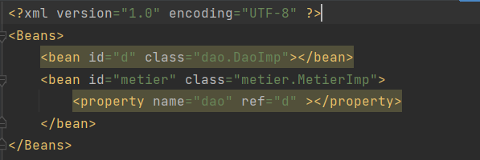
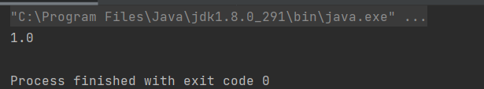

#Dependency injection Framework Test
first our project structure is a dao package and a metier package

[Framework Repository ](https://github.com/yasinkabboura/YasinKabbouraJ2e/tree/main/YasinIoCMiniFramework)

##Project Structure

firstly we need to add our Framework to our Libraries in the project structure

###Dao package structure

####Dao interface

####DaoImp Class

###Metier package structure

####Metier interface

####MetierImp Class

###Presentation Package

####Presentation Class

##XML Config File

#Test

