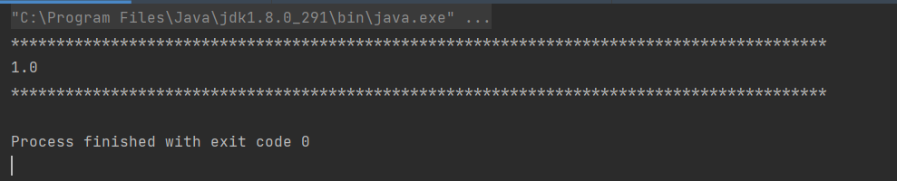
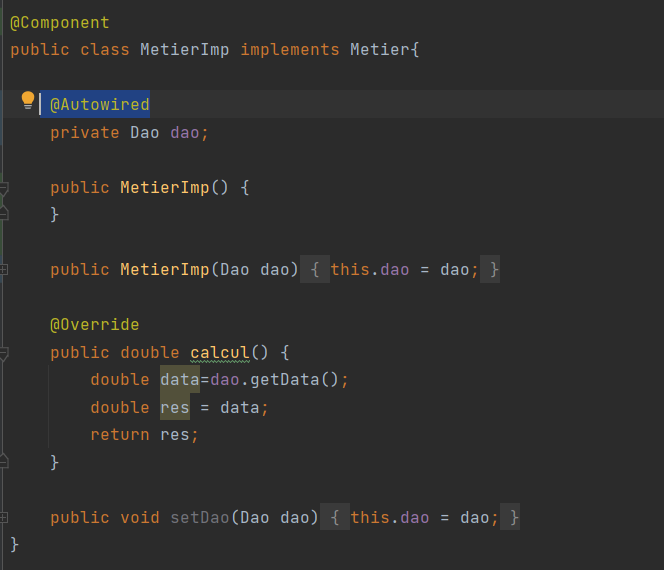

#Dependency injection Framework Test
first our project structure is a presentation.dao package and a presentation.metier package

[Framework Repository ](https://github.com/yasinkabboura/YasinKabbouraJ2e/tree/main/YasinIoCMiniFramework)

##Project Structure

firstly we need to add our Framework to our Libraries in the project structure

###Dao package structure

####Dao interface

####DaoImp Class

###Metier package structure

####Metier interface

####MetierImp Class

###Presentation Package

####Presentation Class

#Test XML file injection

##XML Config File (proberty)

#Test XML file injection

##XML Config File (constructor-arg)

here we used the constructor to inject the dependency

#Test Annotaion

we add the @Component to each class
then we add  @Autowired to each field

we made sure that we change the main method also

